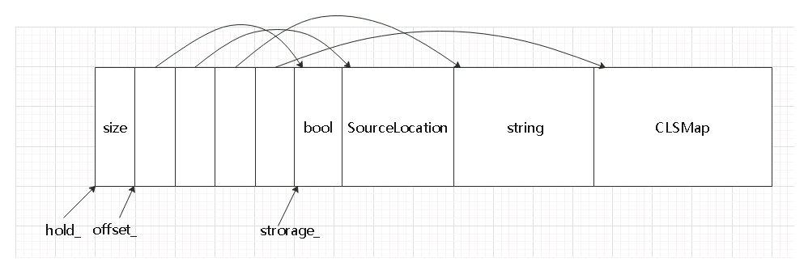

##any.h文件
#####any类
* 存放任何类型的对象
* 用来存放协程局部存储类型的变量
* 实现了类型转换方法any_cast<ValueType>，返回内部数据

##anys.h文件
#####Anys类，存放任何类型对象的类，需预先Register需要保存的元素类型，构造时会根据Register的元素的大小分配适合的内存，使用时在预先分配的内存上new新的对象（placement new)
* 1.静态函数Register
    * 把元素信息保存在静态成员函数GetKeys()中的静态vector\<KeyInfo\>对象中，保存了对齐字节数，首地址偏移量，生成和销毁对象的函数指针
    * 所有元素所占内存空间大小保存在静态成员函数StorageLen()中，每个元素实际所占内存大小：**sizeof(T) + std::alignment_of\<T\>::value - 1**,多分配一些内存是为了调整位置达到内存对齐要求
    * 元素个数保存在静态成员函数Size()中
* 2.调度器构造时会调用staticInitialize函数注册四个元素bool,SourceLocation,string,CLSMap
    * bool
    * SourceLocation:保存协程声明时的文件和行号信息（go foo;),这些信息是组成Debug信息的一部分
    * string:保存Debug信息
    * CLSMap:内部有一个unordered_map<int*,any>成员，用来保存协程局部存储类型的对象，外部使用CLS变量是使用的这个map上的对象的引用
* 3.Ansy实例化时会根据保存在静态函数中的信息申请内存
    * 分配sizeof(size_t) * (1 + 4) + StorageLen()大小的内存赋值给成员char* hold_
    * 给offset_和storage_赋值
    * 调用align函数确保每个元素的内存对齐，对齐后把首地址相对于storage_的偏移量保存在offset_上

##clock.h文件
#####FastSteadyClock类
* 时钟类，提供静态函数now()获取当前时间
* windows平台上，就是std::chrono::steady_clock
* unix平台上
    * 会开启一个线程ThreadRun，每个20ms获取一次时间点tm 和 时钟周期计数tsc, 会保存最近两次的数据，通过最近两次的数据计算时钟频率并保存cycle_ = (tsc1 - tsc2) / (tm1 - tm2).count(), 
    * now函数中先获取当前的时钟周期计数tsc,再根据保存的最新的时钟频率计算当前时间：(tsc - tsc1) / cycle_ + tm1.time_since_epoch().count()
    * 电压等物理因素会影响到cpu工作频率，从而引起时钟的波动

##clock.h文件
* Debug标志位定义
* CoroutineOptions结构体：全局的配置信息
* ErrnoStore类，错误码获取和存储跨平台封装
* 全局函数

##dbg_timer.h文件
* DbgTimer结构体，保存行号和自上次调用到现在所用的时间(ms)

##error.h error.cpp文件
* eCoErrorCode枚举，自定义的错误码
* co_error_category类，继承自std::error_category,使用ThrowError(code)抛出system_error类型的异常
* co_exception,继承自std::exception，使用ThrowException(string)函数抛出此异常类型的异常

##lock_free_ring_queue.h文件
* 无锁环形队列

##spinlock.h文件
* BoolLeanFakeLock类，假锁
* FakeLock类，假锁，提供锁类型的接口，没有实际加锁上锁操作，在不用使用线程安全的TsQueue队列时使用
* LFLock类，使用atomic_flag::test_and_set实现的自旋锁
* LFLock2类，使用atomic_bool::exchange实现的自旋锁

##syntax_helper.h文件
#####__go_option结构体
* 结合宏定义go co_stack co_scheduler实现创建协程的语法
* 重载运算符-: void operator-(Function const& f)是为了语法实现go func;
* 重载运算符-:__go& operator-(__go_option<opt_scheduler> const& opt)是为了实现语法go co_scheduler(sched) func;
* 重载运算符-:__go& operator-(__go_optoin<opt_stack_size> const & opt)是为了实现语法go co_stack(size) func;

##timer.h文件
* Element结构体
   * 保存定时任务的节点：定时时间，执行函数 
* TimerId结构体
   * 定时任务对象，内部的IncursivePtr智能指针内部保存一个Element指针
   * 提供StopTimer方法撤销还未执行的任务
* Timer<F>类
   * 多级时间轮定时器
   * StartTimer,开启一个定时任务，调用Dispatch方法把任务存放到时间轮对应的槽上
   * ThreadRun,循环调用RunOnce方法转动时间轮，此函数会在单独的线程中一直运行。
   * RunOnce，转动一次时间轮，先把completeSlot_上的任务全部执行，再执行经过的槽上的任务或者把任务重新放在槽上（精度提高）
   * Stop,结束定时器线程（ThreadRun)
   * Trigger,执行传入的队列上的所有任务
   * Dispatch,把传入的任务放在时间轮对应的槽上

##ts_queue.h文件
* TSQueueHook,双向链表或队列的节点类型
* SList,双向链表
* TSQueue,双端队列

##util.h文件
* RefObject类，内部维护一个引用计数，构造函数中引用计数加一，一般作为AutoRelease智能指针内部的指针类型
* AutoRelease类，普通智能指针，析构函数中调用内部指针的DecrementRef()函数使引用计数减一
* SharedRefObject类，内部维护一个引用计数，一个RefObjectImpl指针，一般作为共享式智能指针IncursivePtr内部的指针类型
* IncursivePtr类，共享式智能指针
* RefObjectImpl类，弱引用计数类，内部维护一个强引用计数和一个弱引用计数，强引用计数只在lock函数中才会加一（弱智能指针转换为共享式智能指针时会调用），一般作为WeakPtr内部的指针类型
* WeakPtr类，弱智能指针类，与IncursivePtr搭配使用